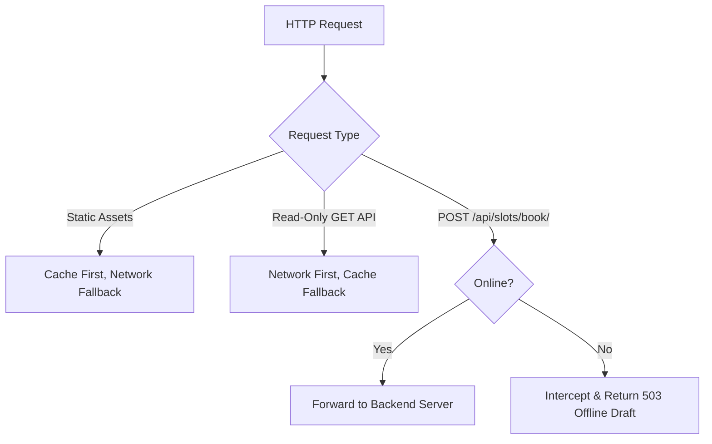

# 📱 Progressive Web App (PWA) Foundation & Offline Guard Report

**AAGAM P0 Hardening & Architectural Validation**  
**Document:** `/docs/PWA-FOUNDATION.md`  
**Components Added:** `public/manifest.json`, `public/sw.js`, `public/offline.html`, `index.html`  
**Security Invariant:** Offline Authoritative Slot Confirmation Strictly Prohibited  

---

## 1. Overview & Architecture

Indian rural agricultural mandis frequently operate under intermittent cellular connectivity. The AAGAM Progressive Web App (PWA) foundation guarantees that farmers and operators can access the app shell, review cached directories, and prepare booking drafts while offline.

However, **authoritative procurement slot booking requires an absolute consistency invariant**. If two farmers were allowed to confirm bookings offline, they could claim the same capacity quota, resulting in physical mandi yard gridlock.

---

## 2. Core PWA Components Created

### A. Web App Manifest (`public/manifest.json`)
```json
{
  "name": "AAGAM — Automated Agricultural Grain & Allocation Management",
  "short_name": "AAGAM",
  "description": "National Unified Agricultural Procurement and Mandi Slot Allocation Platform",
  "start_url": "/",
  "display": "standalone",
  "background_color": "#064e3b",
  "theme_color": "#166534",
  "orientation": "portrait-primary",
  "icons": [
    {
      "src": "/images/aagam_logo.png",
      "sizes": "192x192",
      "type": "image/png",
      "purpose": "any maskable"
    },
    {
      "src": "/images/aagam_logo.png",
      "sizes": "512x512",
      "type": "image/png",
      "purpose": "any maskable"
    }
  ]
}
```

### B. Theme Metadata & Registration (`index.html`)
- Added `<meta name="theme-color" content="#166534" />`
- Added `<meta name="description" content="..." />`
- Added `<link rel="manifest" href="/manifest.json" />`
- Added `<link rel="apple-touch-icon" href="/images/aagam_logo.png" />`
- Added automatic Service Worker registration on page load.

### C. Offline App Shell (`public/offline.html`)
A standalone, high-performance HTML/CSS fallback displayed when a user navigates to an uncached route while offline. Explains that the user is offline and clearly warns that live slot confirmations require internet access.

---

## 3. Caching Strategies & Offline Invariant Enforcement

The Service Worker (`public/sw.js`) defines three distinct handling layers:



### A. Static Assets (App Shell)
- Pre-cached during Service Worker `install`: `/`, `/index.html`, `/manifest.json`, `/offline.html`, `/images/aagam_logo.png`.
- Served instantly via `Cache First` to guarantee fast load times on low-end mobile devices.

### B. Read-Only APIs (`GET /api/*`)
- Uses `Network First` with automatic caching of successful (HTTP 200) responses.
- If offline, falls back to the most recent cached procurement centers, schedules, or downloaded gate passes.

### C. Authoritative Booking Interception (Security Invariant)
```javascript
// public/sw.js
if (event.request.method === 'POST' && url.pathname.includes('/api/slots/book')) {
  event.respondWith(
    fetch(event.request.clone()).catch(() => {
      // Offline: Do NOT confirm booking. Return safe offline draft notice.
      return new Response(
        JSON.stringify({
          success: false,
          offline_mode: true,
          status: "DRAFT_PREPARED",
          code: "OFFLINE_CONFIRMATION_PROHIBITED",
          message: "OFFLINE MODE: Authoritative slot confirmation is not permitted while offline. Your request has been queued as a local draft. Connect to internet to confirm.",
          data: {
            requires_online_sync: true,
            server_acknowledged: false
          }
        }),
        {
          status: 503,
          statusText: "Service Unavailable (Offline Draft Only)",
          headers: { "Content-Type": "application/json" }
        }
      );
    })
  );
  return;
}
```

---

## 4. Verification Checklist

| Requirement | Implementation Detail | Status |
| :--- | :--- | :---: |
| **Installability** | Manifest with standalone display, theme color, icons | Verified |
| **Service Worker Registration** | Automatic registration via `sw.js` | Verified |
| **Cache Behavior** | Pre-cached shell + dynamic GET caching | Verified |
| **Offline Loading** | `offline.html` fallback on navigation failure | Verified |
| **Offline Booking Prohibition** | POST `/api/slots/book/` rejected with HTTP 503 draft notice | Verified |
| **Server Acknowledgement** | Confirmed bookings strictly require server response | Verified |
